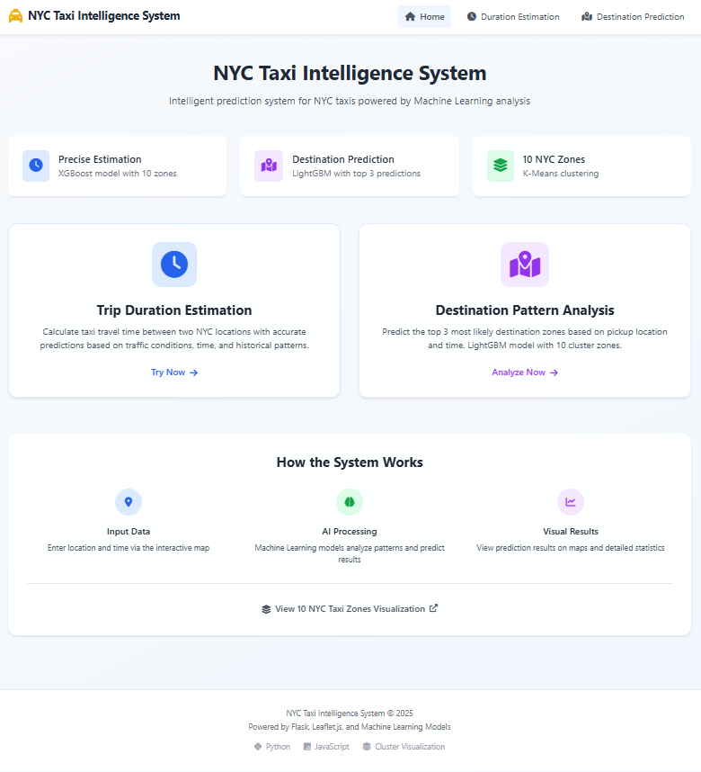
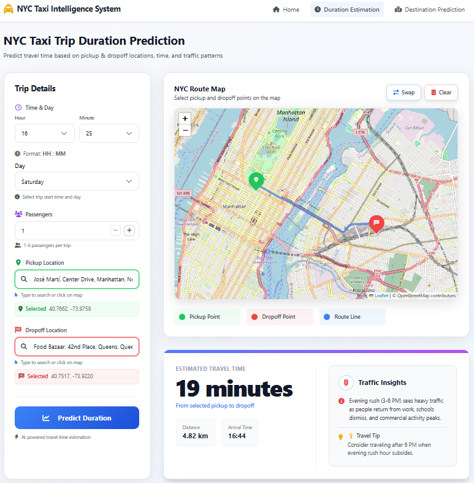
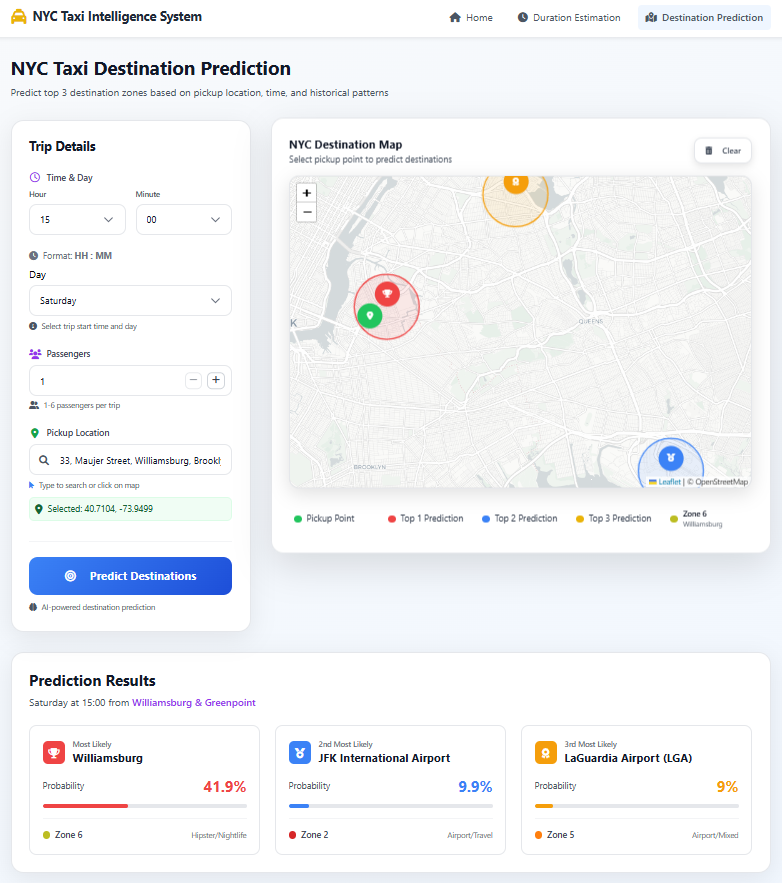

<div align="center">

# 🚖 NYC Taxi Intelligence System


<p align="center">
  <strong>An End-to-End Data Science Solution for New York City Taxi Drivers</strong><br>
  Predict trip durations, optimize routes, and visualize demand hotspots using Hybrid AI Architecture.
</p>

</div>

---

## 📖 Project Overview

**NYC Taxi Intelligence System** combines the power of **Big Data Processing (Spark)** with lightweight **Real-time Inference (Flask)**. This project is designed to help drivers maximize efficiency by predicting trip times accurately and identifying high-probability destination zones to minimize empty trips (deadheading).

---

## 📸 Application Showcase

### 1. Smart Dashboard
The central hub for accessing all predictive tools. It features a modern, responsive design built with Tailwind CSS.


<br>

### 2. Trip Duration Estimator
Uses **XGBoost Regressor** to predict travel time based on traffic patterns, cyclical time features, and geocoordinates.


<br>

### 3. Destination & Route Prediction
Uses **LightGBM Classifier** to predict the top 3 most likely drop-off zones, helping drivers plan their next move strategically.


<br>

### 4. Interactive Zone Visualization
Visualizes **10 Strategic Clusters** generated via K-Means, showing real-time statistics like average speed and passenger volume per zone.


---

## 🌟 Key Features

* **⏱️ Precision Timer:** Calculates arrival times with high accuracy using log-transformed regression targets.
* **🎯 Smart Destination Forecasting:** Predicts the probability of a passenger's destination zone, helping drivers understand trip demand from their current location.
* **🗺️ Dynamic Zoning:** Replaces static administrative boundaries with data-driven K-Means clusters for better demand representation.
* **📊 Traffic Analytics:** Aggregates historical speed and volume data to understand rush hour dynamics.

---

## 🛠️ Tech Stack & Methodology

| Component | Technology | Description |
| :--- | :--- | :--- |
| **Big Data** | **Apache Spark** | Processing 1.4M+ records, cleaning outliers, and feature engineering. |
| **Modeling** | **XGBoost** | Optimized for Regression (Duration Prediction). |
| **Modeling** | **LightGBM** | Optimized for Multiclass Classification (Destination Prediction). |
| **Backend** | **Flask (Python)** | Serving models via REST API endpoints. |
| **Frontend** | **Tailwind + Leaflet** | Responsive UI with interactive maps. |

---

## 🚀 Installation & Usage

### Prerequisites
* Python 3.10+
* Git

### Quick Start Guide

1.  **Clone the Repository**
    ```bash
    git clone [https://github.com/FerrelNW/nyc-taxi-intelligence-system.git](https://github.com/FerrelNW/nyc-taxi-intelligence-system.git)
    cd nyc-taxi-intelligence-system
    ```

2.  **Create Virtual Environment**
    ```bash
    python -m venv venv
    # Windows:
    venv\Scripts\activate
    # Mac/Linux:
    source venv/bin/activate
    ```

3.  **Install Dependencies**
    ```bash
    pip install -r requirements.txt
    ```

4.  **Check Models**
    Ensure the `models/` directory contains:
    * `xgb_problem1_final.pkl`
    * `lgbm_destination_prediction.pkl`
    * `cluster_centroids.json`

5.  **Run Application**
    ```bash
    python app.py
    ```

6.  **Open Browser**
    Go to `http://localhost:5000`

---

👨‍💻 Author: **Ferrel N W**
